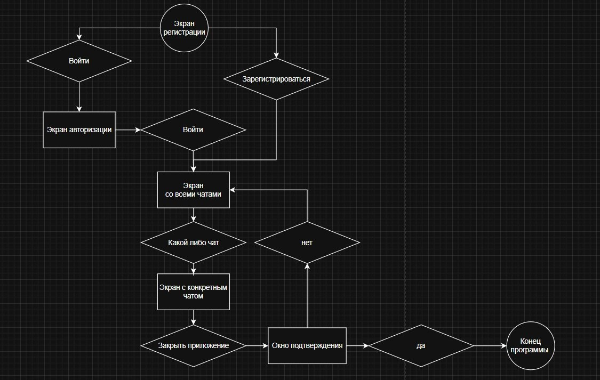

## Moon Messenger

| Студент | Ерёмин Степан Алексеевич |
| ------- | ------------------------ |
| Группа  | С424                     |
## 1. Краткое описание идеи

Moon — это базовый десктопный мессенджер с графическим интерфейсом, который позволяет пользователям общаться через локальную или домашнюю сеть. Приложение состоит из двух компонентов: сервера, который маршрутизирует сообщения, и клиента с визуальным интерфейсом для общения.
## 2. Цель разработки

Разработать демо-мессенджера реального времени с использованием C++, Qt и TCP-сокетов, демонстрирующий навыки сетевого программирования, работы с базами данных и проектирования пользовательского интерфейса.
## 3. Целевая аудитория

Пользователи локальных сетей: студенты, сотрудники офисов, участники локальных игровых сессий — все, кому нужен быстрый защищённый мессенджер без зависимости от внешних серверов и интернета.
## 4. Основные пользовательские задачи

- Зарегистрироваться и войти в систему по логину и паролю
- Отправлять личные сообщения конкретному пользователю
- Видеть список пользователей онлайн в реальном времени
- Просматривать историю переписки после повторного входа
## 5. Язык программирования и инструменты

| Технология                  | Назначение                                |
| --------------------------- | ----------------------------------------- |
| **C++**                     | Основной язык разработки                  |
| **Qt**                      | GUI-фреймворк, сигналы и слоты            |
| **QTcpServer / QTcpSocket** | TCP-соединение, передача сообщений        |
| **SQLite (Qt SQL)**         | Хранение пользователей и истории          |
| **Qt Creator**              | Среда разработки (Qt Designer, QTCreater) |

## 6. Планируемый тип интерфейса

Десктопное GUI-приложение на Qt Widgets. Два отдельных экрана: экран авторизации/регистрации и главное окно мессенджера с панелью контактов, областью чата и полем ввода сообщений.

## 7. Ожидаемый итоговый результат

| Компонент | Что умеет |
|---|---|
| **server.exe** | Принимает подключения, маршрутизирует сообщения между клиентами |
| **client.exe** | Авторизация, общий чат, личные сообщения, история, список онлайн |

На итоговой демонстрации: запущен сервер и два клиента на разных машинах в одной сети — участники переписываются в реальном времени, для работы онлайн. Как костыль можно использовать различные VPN сервисы, как RatminVPN или Tilescale для подключения к одному IP(Решение с впн работает только в теории нужно проверить).
## 8. Возможные доработки после практики

| Доработка                                | Описание                                                                     |
| ---------------------------------------- | ---------------------------------------------------------------------------- |
| **Работа через интернет**                | Аренда VPS-сервера — клиенты подключаются по внешнему IP из любой точки мира |
| **Шифрование**                           | Шифрование сообщений по протоколу TLS/SSL для защиты переписки               |
| **Файлы и медиа**                        | Отправка изображений и файлов между пользователями                           |
| **Мобильный клиент**                     | Клиентское приложение на Android с использованием Qt for Android             |
| **Web клиент**                           | Создание веб клиента для работы с мессенджером без его установки в браузере  |
| **Группы и каналы**                      | Создание групповых чатов с управлением участниками                           |
| **Обновление визуала**                   | Более интересный подход к работе с дизайном приложения и тд                  |
| **Сборка в полноценную социальную сеть** | Дуров вернул стену, но в Moon.                                               |

